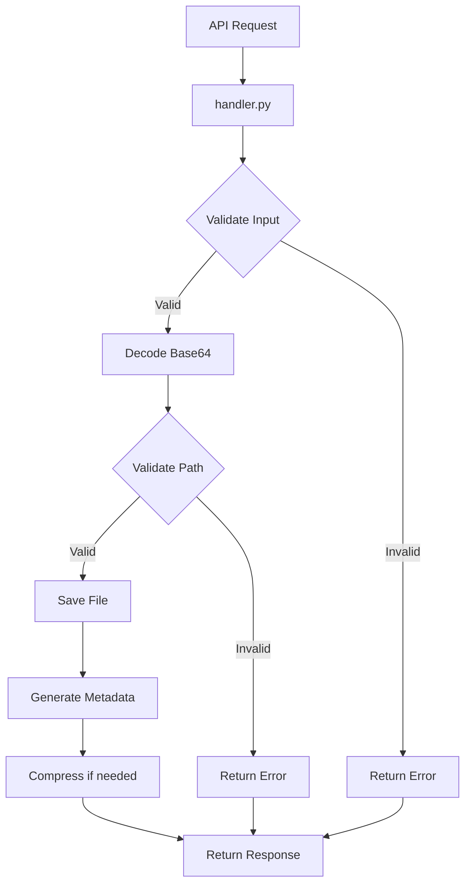

# RunPod File Saver Worker

A serverless worker for RunPod that saves files from Base64-encoded data.

## Overview

This worker provides a simple, efficient way to save files on a RunPod serverless endpoint. It receives Base64-encoded file data along with destination information, decodes the data, and saves it to the specified location.

## Architecture

The file saver worker follows a simple, efficient architecture:



The worker:
1. Receives HTTP requests through RunPod's serverless infrastructure
2. Validates input parameters
3. Decodes the Base64-encoded bytearray
4. Validates the destination path for security
5. Creates directories if needed
6. Saves the file
7. Generates file metadata (size, timestamp, etc.)
8. Optionally compresses the file
9. Returns a response with success/failure status and metadata

## Project Structure

```
workers/file-saver/
├── Dockerfile            # Container definition for the worker
├── requirements.txt      # Python dependencies
├── handler.py            # Main entry point for the worker
├── utils/
│   ├── __init__.py       # Makes utils a proper package
│   ├── validation.py     # Input and path validation functions
│   ├── file_ops.py       # File operations (save, compress)
│   └── metadata.py       # Functions for generating file metadata
└── tests/                # Unit tests for the worker
    ├── __init__.py
    ├── test_validation.py
    ├── test_file_ops.py
    └── test_metadata.py
```

## API Design

### Input Schema

```json
{
  "destination_folder": "/path/to/folder",  // Required: Where to save the file
  "filename": "example.jpg",                // Required: Name of the file to save
  "file_data": "base64_encoded_string",     // Required: Base64-encoded file data
  "compress": false                         // Optional: Whether to compress the file (default: false)
}
```

### Output Schema

```json
{
  "success": true,                          // Boolean indicating success/failure
  "file_path": "/path/to/folder/example.jpg", // Full path to the saved file
  "metadata": {
    "size": 1024,                           // File size in bytes
    "mime_type": "image/jpeg",              // Detected MIME type
    "created_at": "2025-05-15T17:30:00Z",   // ISO timestamp
    "compressed": false                     // Whether the file was compressed
  },
  "error": null                             // Error message (null if success)
}
```

## Dependencies

```
# requirements.txt
pydantic>=2.0.0,<3.0.0  # For input validation
python-magic>=0.4.27,<0.5.0  # For file type detection
loguru>=0.7.0,<0.8.0  # For better logging
```

## Performance Optimizations

1. **Streaming Processing**: For large files (up to 100MB), uses streaming processing to decode and write the file without loading the entire content into memory.

2. **Chunked File Writing**: Writes files in chunks to minimize memory usage.

3. **Asynchronous I/O**: Uses asynchronous I/O for file operations to improve throughput.

4. **Minimal Dependencies**: Keeps dependencies to a minimum to reduce Docker image size.

5. **Alpine-based Docker Image**: Uses a lightweight Alpine-based Python image to minimize container size.

6. **Path Validation Optimization**: Implements efficient path validation that catches security issues without excessive overhead.

7. **Optional Compression**: Makes compression optional and uses efficient algorithms (like zlib) when needed.

8. **Error Handling**: Implements robust error handling with appropriate logging but minimal overhead.

9. **Caching**: Implements simple caching for frequently accessed directories to speed up path validation.

10. **Parallel Processing**: For very large files, considers implementing parallel processing for decoding and compression.

## Security Considerations

1. **Path Traversal Prevention**: Validates paths to prevent directory traversal attacks.

2. **Input Validation**: Uses Pydantic for robust input validation.

3. **Error Handling**: Implements proper error handling to prevent information leakage.

4. **Logging**: Logs errors and access attempts for security monitoring.

5. **File Size Limits**: Optimized for files up to 100MB, with appropriate handling for larger files.

## Implementation Notes

- The worker is designed to be lightweight and efficient, with a focus on minimizing Docker image size.
- Error handling is done internally with logging, with a simple success/failure boolean returned to the caller.
- File metadata is included in the response for successful operations.
- The worker supports basic file compression when requested.